# DMD Mutation and Exon-Skipping Explorer

**BSGP 7030 Capstone — research and educational web application**

Interactive Streamlit tool for mapping mutations in the human *DMD* gene relative to the Dp427m transcript, evaluating reading-frame consequences, and exploring computational exon-skipping strategies.

> **Not for clinical use.** Frame-restoration candidates are theoretical calculations only.

## Reference transcript

| Field | Value |
|-------|-------|
| Gene | DMD |
| Isoform | Dp427m |
| RefSeq transcript | NM_004006.3 |
| RefSeq protein | NP_003997.2 |
| Ensembl transcript | ENST00000357033.9 |
| Assembly | GRCh38 |
| Chromosome / strand | X / reverse |
| Coding exons | 79 |
| Protein length | 3,685 aa |

## Application tour

The application is organized as a five-page research workflow. The screenshots
below were captured from the running Streamlit application and document the
purpose and major controls of every page. The interface is intended for
research and education; predicted frame-restoration strategies are
computational results, not clinical recommendations.

### Home

**Purpose:** Introduces the project, identifies the active Dp427m reference,
summarizes the five pages, and lists supported variant-input formats. Start
here to confirm that the 79-exon reference loaded successfully and to choose
the next stage of the workflow.

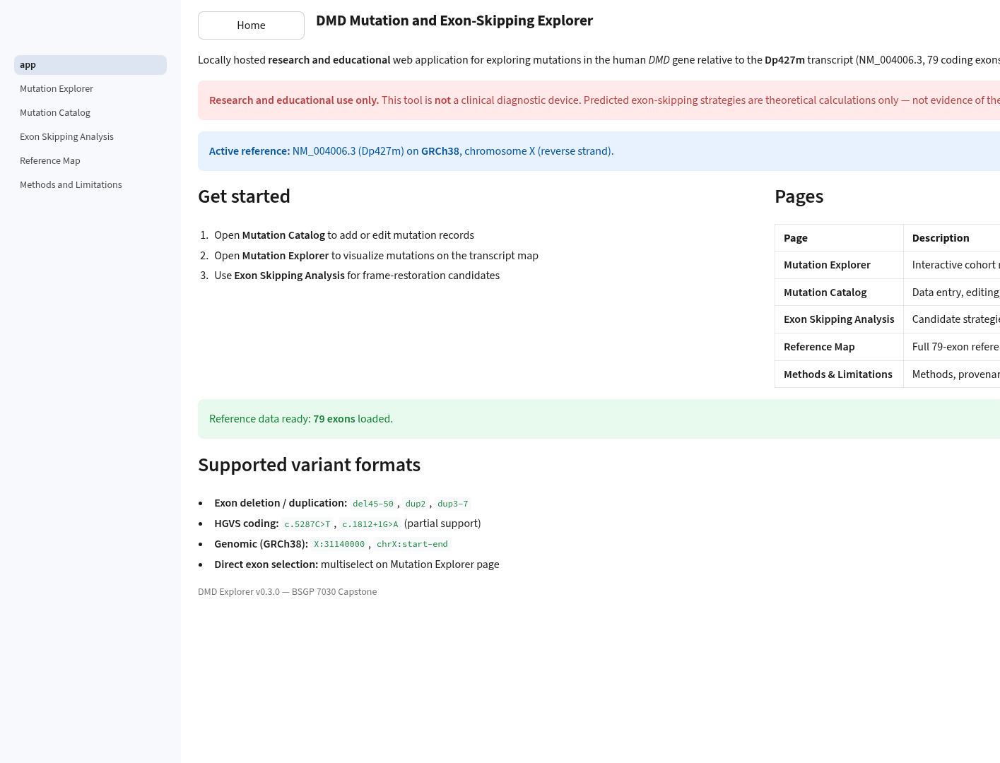

### Mutation Explorer

**Purpose:** Places selected cohort mutations on a common Dp427m
transcript/protein-domain map so their locations and affected regions can be
compared visually.

- The upper map aligns all 79 coding exons with broad dystrophin domains and
  hinge boundaries.
- Filters narrow the catalog by mutation class, subclass, frame, and
  phenotype.
- The editable selection column controls which participant rows are plotted.
- Hover content reports exon, domain, and participant details; the horizontal
  navigator supports inspection of the full transcript.
- The collapsed download control exports a static PNG version of the map.

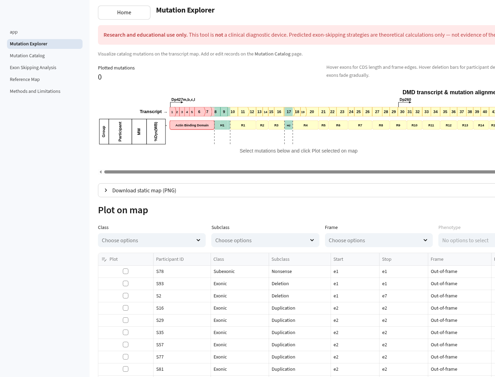

### Mutation Catalog

**Purpose:** Creates, reviews, edits, imports, and exports the mutation records
used by the rest of the application. Catalog edits affect the Mutation
Explorer and catalog-driven exon-skipping analyses.

#### Data entry and computed annotation

The quick-entry field accepts supported mutation notation and can populate the
structured form. Researchers can also enter participant, mutation, frame,
phenotype, molecular, and experimental fields manually. Computed frame,
domain, and expected-protein fields can be autofilled from the local reference
before the record is added.

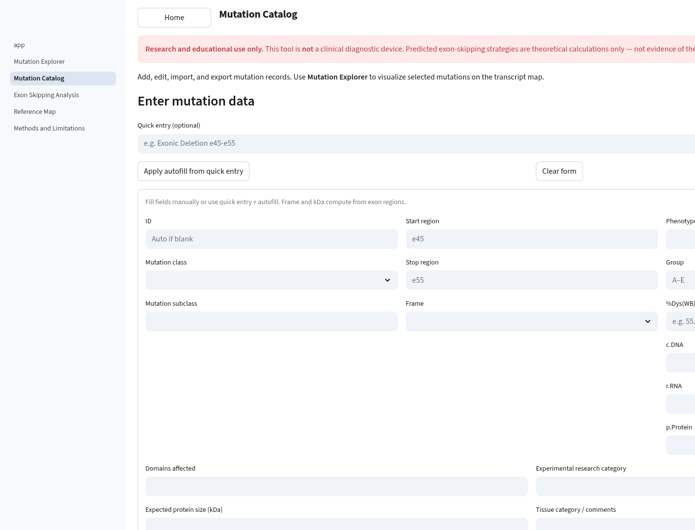

#### Import, export, table editing, and audit controls

The import/export area downloads the active catalog or accepts an edited CSV.
The table supports direct correction and deletion of records, with explicit
save/reset controls. Audit history exposes record-level changes, while catalog
management contains secondary maintenance actions.

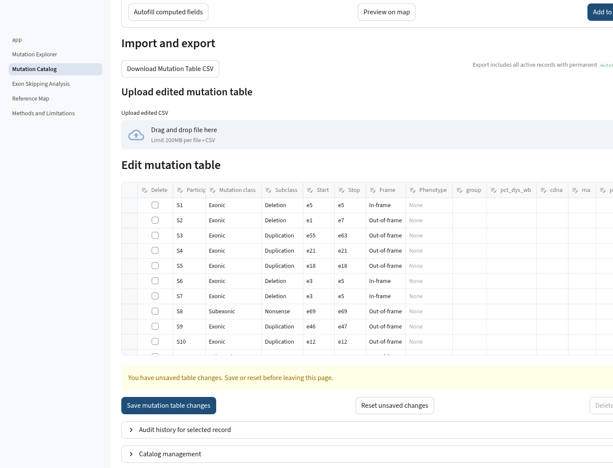

### Exon Skipping Analysis

**Purpose:** Evaluates mutation-specific, whole-exon skipping strategies and
retains only candidates whose net coding-length change is divisible by three.
Candidates are ranked by the fewest additional exon targets and then by the
least additional coding sequence removed.

The sidebar records the active reference and accepts a mutation, search limit,
advanced-search option, and schematic display mode. Deletions and tandem
duplications are modeled separately: deleted exons cannot be targeted, while
duplication-correction candidates must include the duplicated interval.

#### Model by exon target

Choose a therapeutic target exon and a single-, multi-, or all-candidate mode.
The application first calculates valid frame-restoring candidates for each
mutation and only then filters for candidates containing the selected exon.
The results table keeps participant ID, mutation description, candidate rank,
and complete skip combination in separate fields. Selecting a row opens its
mutation-specific detail.

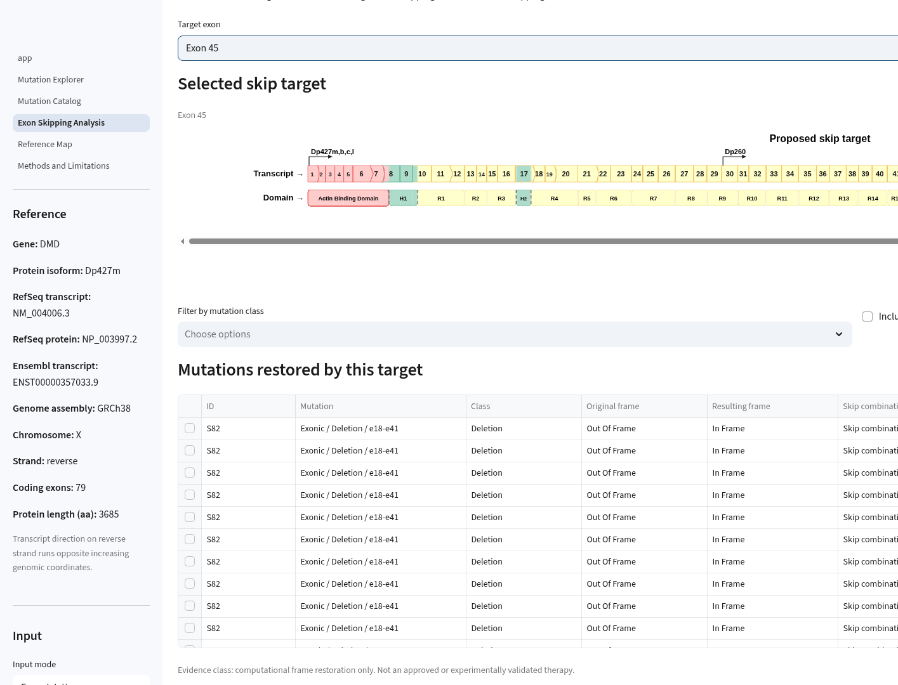

#### Model by mutation

Start from the current mutation entry or the catalog to compare ranked skip
combinations per mutation. The detail area reports the original and resulting
frame, candidate count, altered junction, additional exons and bases removed,
and estimated protein length. Colored outlines distinguish the top three
candidate combinations on the transcript schematic.

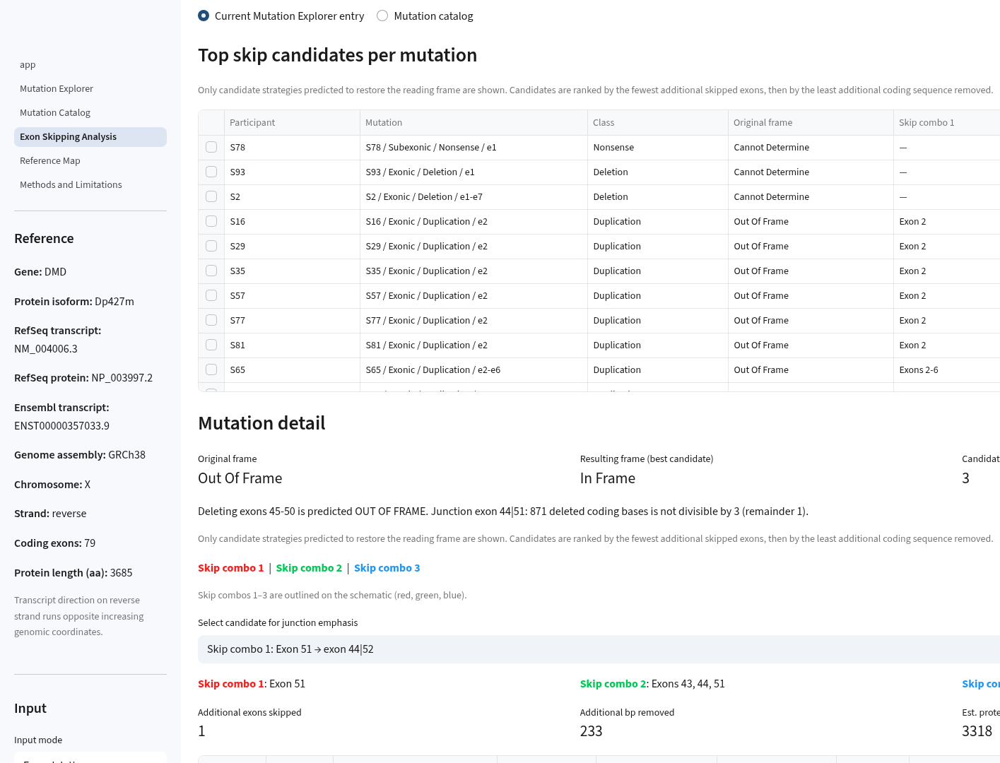

### Reference Map

**Purpose:** Provides a reproducible, continuous-scroll reference atlas from
genomic coordinates to spliced-transcript coordinates, protein amino-acid
coordinates, and source provenance. These coordinate systems are related but
are deliberately kept separate.

#### Coordinate overview and genomic viewer

The opening guide defines each coordinate system and links to the four major
sections. The genomic viewer uses standard ascending chromosome X coordinates,
shows the GRCh38 DMD locus and reverse-strand transcription direction, and
aligns the gene span, introns, and coding exons. Plotly zoom, pan, reset, hover,
and range-navigation controls support locus inspection.

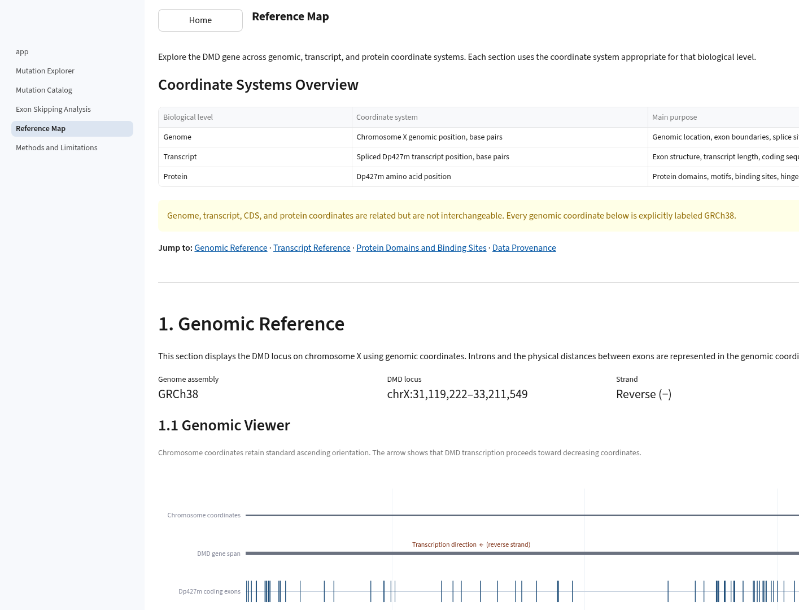

#### Genomic coding-exon reference

The searchable table reports numeric coding-region and full-exon genomic
boundaries, strand, assembly, transcript, and sequence accessions. Coding
coordinates are not mixed with transcript positions or styling metadata. A CSV
download preserves coordinate fields as numeric values, and the assembly
warning guards against unconverted GRCh37/GRCh38 mixing.

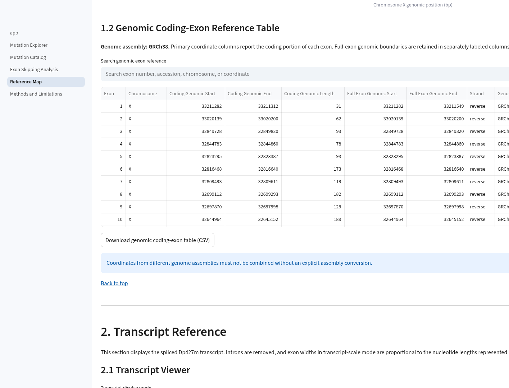

#### Transcript viewer and exon reference

The transcript viewer switches between an equal-width exon-order schematic and
a proportional **Mature transcript scale**. The latter spans the complete
13,992-bp spliced transcript, including 5′ and 3′ UTR sequence; introns are
omitted. The exon table keeps complete transcript positions, cumulative CDS
offsets, UTR lengths, splice phases, encoded amino-acid ranges, and protein
regions in explicitly labeled columns.

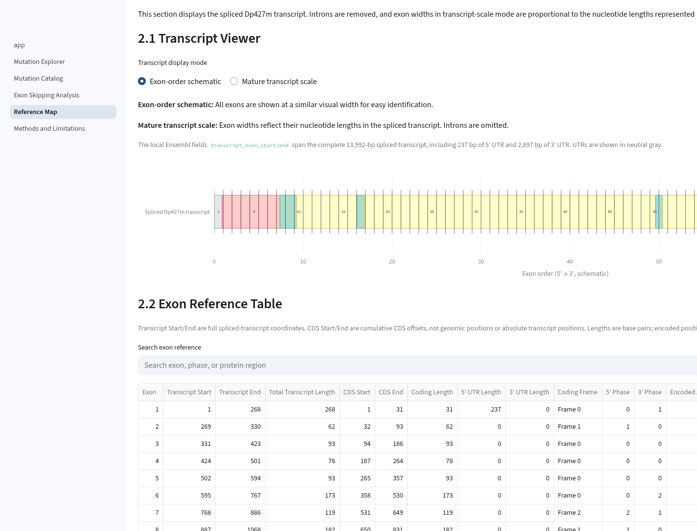

#### Exon styling reference

The styling table documents the visual language used in the transcript
viewer—one row per meaningful biological class rather than one row per exon.
It separates colors, borders, opacity, labels, and biological meaning from the
scientific coordinate tables.

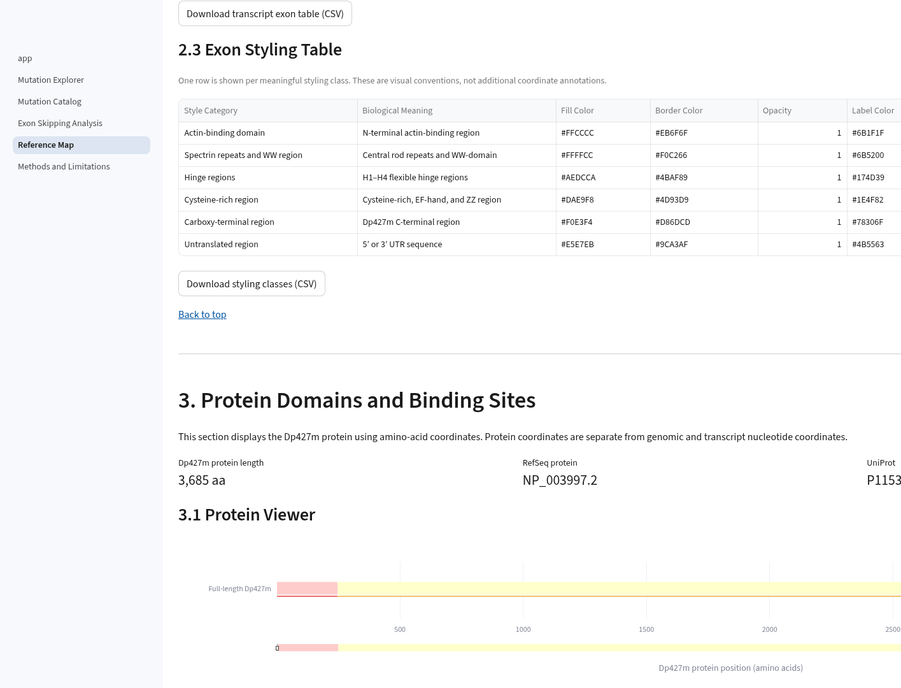

#### Protein viewers and feature table

The full-length protein overview orients users along the 3,685-aa Dp427m
sequence. The detailed viewer places major regions, spectrin repeats, hinges,
binding sites, and functional motifs on separate tracks with a shared
amino-acid axis. The searchable/filterable table reports feature category,
amino-acid boundaries, encoded exons, colors, source coordinates, and notes.
A visible warning retains the documented Leiden source-coordinate conflict
instead of silently treating transcript-nucleotide positions as amino acids.

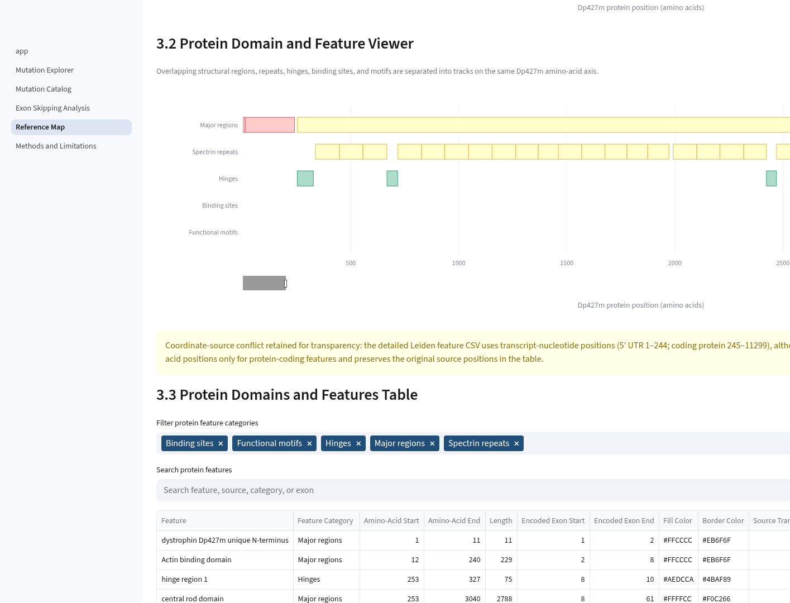

#### Protein styling summary and provenance

The styling atlas explains the colors used for major domains, repeats, hinges,
cysteine-rich and carboxy-terminal regions, and untranslated sequence. The
provenance table then records accessions, assembly, source organization, local
module, access date, and transformation notes for each data element.

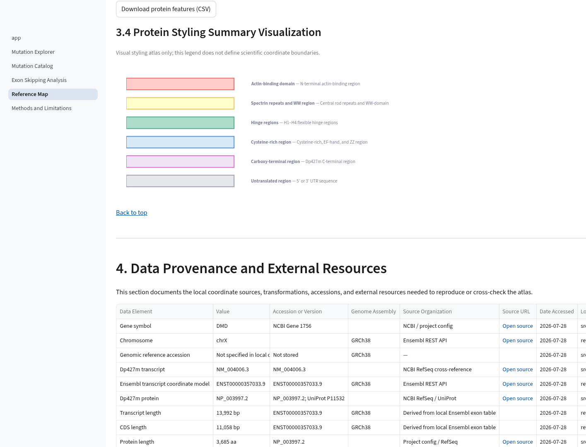

#### Coordinate safeguards and external resources

The final section states the coordinate-handling rules and groups authoritative
DMD, genome-browser, NCBI, protein, and aggregate resources into expandable
collections. BLAST is labeled as a sequence-comparison resource—not an
exon-coordinate source—and GeneCards is identified as an aggregate portal.

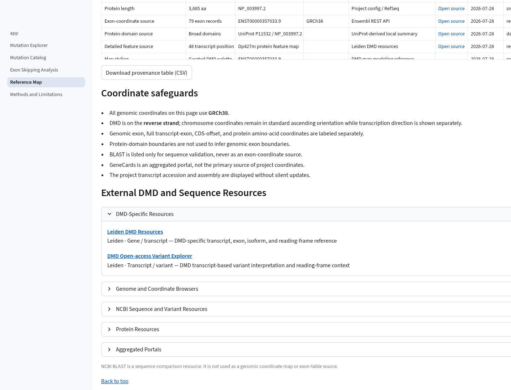

### Methods and Limitations

**Purpose:** Makes the application's assumptions, supported inputs, frame
calculations, search ranking, provenance, and limitations visible in one place.
Read this page before interpreting any analysis output.

The first half identifies the exact reference assembly and accessions, lists
supported deletion, duplication, HGVS, genomic, and direct-exon inputs, and
explains how coding lengths and splice phases are used in reading-frame calls.

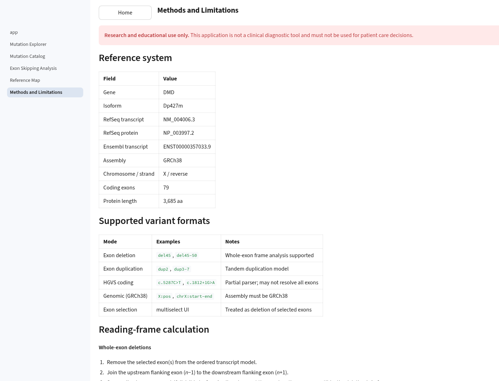

The second half explains exon-skipping search order and ranking, explicitly
states that frame restoration is not evidence of therapeutic feasibility,
lists model and annotation limitations, identifies the Ensembl and UniProt
sources, and links to the project's AI-use statement.

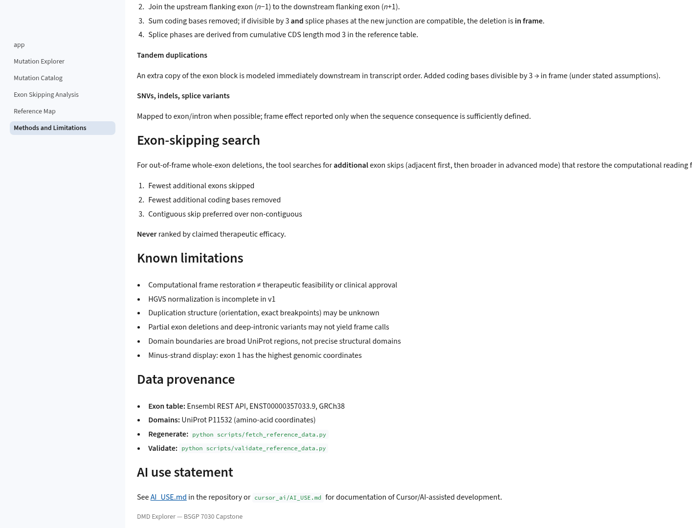

## Repository layout

```text
DMD_webapp/
├── app.py                      # Streamlit entry point
├── ai_prompt.md                # AI session handoff (full project context)
├── environment.yml             # Conda environment
├── requirements.txt
├── README.md
├── DEMO.md
├── AI_USE.md
├── LICENSE
├── .streamlit/config.toml
├── data/                       # Reference tables + mutation catalog
├── src/                        # Application logic
├── pages/                      # Streamlit multi-page modules
├── scripts/                    # Reference figure + data utilities
├── tests/                      # pytest suite (82 tests)
└── outputs/                    # Generated previews (gitignored content)
```

Parent repository (`7030_Capstone/`) contains earlier batch scripts under `data/input/`.

## Environment setup

```bash
module load miniconda3/24.1.2-py310
conda activate 7030_capstone
conda env update --name 7030_capstone --file DMD_webapp/environment.yml
```

> **Do not use `--prune`** — the environment is shared with prior coursework.

Verify:

```bash
python -c "import streamlit, plotly, Bio; print('OK')"
```

## Running the app

From `DMD_webapp/`:

```bash
export MPLCONFIGDIR=~/7030_Capstone/DMD_webapp/.mplconfig
python -m streamlit run app.py --server.port 8503 --server.headless true
```

**OSC + laptop tunnel:**

```bash
ssh -N -L 8503:localhost:8503 frair7@ascend.osc.edu
```

Open **http://localhost:8503/Mutation_Explorer**

Select catalog rows and click **Plot selected on map** to show patient deletion bars.

## Development status

| Phase | Description | Status |
|-------|-------------|--------|
| 1 | Structure, environment, minimal app | Complete |
| 2 | Authoritative exon reference data | Complete |
| 3 | Parsing, frame analysis, skip search | Complete |
| 4 | Plotly visualization | Complete |
| 5 | Full Streamlit UI + cohort map | Complete |
| 6 | Tests, validation, documentation | In progress |

## Testing

```bash
cd DMD_webapp
export MPLCONFIGDIR=.mplconfig
PYTHONPATH=. pytest -q
```

## Data provenance

- Exon coordinates: Ensembl ENST00000357033.9 → `data/dmd_exons_grch38.csv`
- Cohort map styling: `scripts/reference_make_figure.py` (user-verified fractional domain splits)
- Mutation catalog: `data/mutation_catalog.csv`

See [data/README.md](data/README.md) for details.

## AI use statement

See [AI_USE.md](AI_USE.md). For session handoff context, see [ai_prompt.md](ai_prompt.md).

## License

MIT — see [LICENSE](LICENSE).
